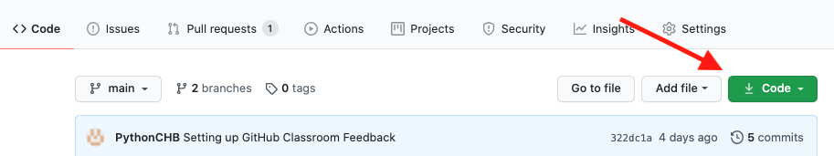
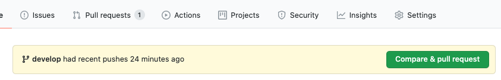

.. _github_classroom:

#############################
Working with GitHub Classroom
#############################

The Python Certificate program uses `GitHub Classroom <https://classroom.github.com/>`_ to manage the submission and review of your coding assignments.

Why GitHub Classroom?
=====================

A software development project is all about continuous improvement:

1. An opportunity is identified.

2. Some initial code is written to address that opportunity.

3. Feedback is provided for that code.

4. The code is modified to create that feedback.

5. A final version of the code is released.

Steps 3-4 will be repeated multiple times until the development team (which could even be a single developer) deems it is ready for release.

In this course, you will not only learn about Python but also about the development process that most Python projects (and virtually any other programming language) go through. GitHub Classroom allows for the steps indicated above to be completed in an academic environment.

Initial Setup
=============

You will need an account on GitHub to participate in this course.
If you don't have already have a GitHub account or if you would prefer to create a new one for this course, make sure you setup a new account on `GitHub <https://github.com/>`_. Always keep in mind that your account name will be part of the private repositories that will be created for each of your assignments and it will be visible to both your instructors and your classmates. Make sure you let your instructors know what your github handle is -- it's not always obvious!

You will need to have git setup on the computer you will use for developing your code for this course.
You can find instructions for setting up git (and the rest of your development environment) here:

:ref:`installing_python`

Once you have all the tools set up, you will need to create a folder (directory) within your development system for keeping your work.
This is the folder where all your assignment repositories will reside. It will be helpful to keep them all together in one place.
This folder (directory) should be somewhere in your "user" or "home" directory.

Accepting an Assignment
-----------------------

On each assignment page there should be a link to the assignment on gitHub classroom. Click on this link, and it should take you to gitHub classroom, and allow you to "Accept this Assignment".

.. note:: The first time you accept an assignment, gitHub will "invite" you to join the class organization. You will need to click the link to accept the invitation. Once you have done that the first time, you shouldn't need to do it again.

Some Things to Consider
.......................

* You will need to accept each assignment separately.

* Accepting an assignment will trigger the creation of a new gitHub repository for you to work on your assignment. That repository will be in your gitHub account. By default it is "private", so that only you and the instructors will be able to see it.

* This repository is only assigned to you.

* Any work you do there will not affect the work of your classmates.

* The name of the new repository will include your GitHub user name at the end.

Once your repository has been created, go to its link (provided by gitHub) and clone it on your development system, under the folder you selected for this purpose.

Here: `Cloning a repo <https://docs.github.com/en/github/creating-cloning-and-archiving-repositories/cloning-a-repository>`_
is GitHub's official guide on how to clone a repository.

.. _github_classroom_workflow:

GitHub Classroom Assignment Workflow
====================================

The following is the workflow you will need to follow for each individual assignment.

Accept the Assignment
---------------------

The first step is to click on the link for the assignment in your LMS (Canvas or Edx) -- that will take you to gitHub classroom, where you can accept the assignment.

When you accept, gitHub will create a new repository for the assignment, in your gitHub account.

Clone the Repo
--------------

Once the repository has been created on gitHUb, you need to make a copy, or "clone" of it on your local workstation, where you will be writing your code.

To Clone:
.........

1) Click on the "Code" button:

..   :width: 600

2) Copy the "https: " url that shows up -- you can click the little clipboard icon to copy -- or highlight and copy the url

.. image:: images/githubclassroom/clone_url.png
..   :width: 600

3) Go to your command line in the terminal application (Terminal, git Bash, CMD prompt, etc). Make sure you are "in" the directory that you have set up for this class. ``ls``, ``dir`` and ``pwd`` can be helpful to make sure.

4) Clone the repo

::

   git clone https://github.com/UWPCE-Py310-Fall2020/the_assignment_url.git

(you should be able to type ``git clone`` and then paste the url you copied from gitHub)

This will create a new directory for the repository, named by the assignment and your giHub handle -- this is where you will put all the work for that assignment.

5) Start working

::

  cd the_name_of_the_assignment_repo

6) Create a new branch for your work and "check it out"

::

  git checkout -b develop

After that command, git will be "in" the develop branch -- anything you change will only be reflected in that branch.

.. note:: A git "branch" is an independent "part" of a repo where you can write and change code, create and delete files, etc, and it will be kept separate from the main code. When you are happy with this version, it can be merged into the main branch. For the purposed of this course, it will not be merged into the main branch until it has been reviewed, and both you and your instructors think its done.

7) Check the git status

::

  $ git status
  On branch develop
  nothing to commit, working tree clean

That lets you know that you are on the develop branch, and that you haven't made any changes to your files (the "working tree" is the dir and files on your machine)

8) Add some files. Create a new file or files for the assignment with your text editor. Once they are there, it's a good idea to add them before you do much work on them, but you can add them at any time.

::

  git add a_new_file.py

You can also add all the files in the directory with::

  git add .

But be careful -- only do that if you really want everything added to git.

9) Commit your work. When you have gotten to a good "pause point" in your work -- the first feature works, or you need help from the instructors, etc, you can "commit" the current state of your project. It's a good idea to check the status first.

::

    $ git status
    On branch develop
    Changes to be committed:
      (use "git restore --staged <file>..." to unstage)
        new file:   a_simple_script.py
        new file:   another_file.py
        new file:   install_test.py

    Changes not staged for commit:
      (use "git add <file>..." to update what will be committed)
      (use "git restore <file>..." to discard changes in working directory)
        modified:   install_test.py

note that in this case, I edited the ``install_test.py`` file after adding it. When you edit a file, git will not track those changes unless you tell it to, which you can to by calling ``git add`` again. So ``git add`` tells git that you want it to keep track of that file -- called "staging for commit"::

    $ git add install_test.py 

    $ git status
    On branch develop
    Changes to be committed:
      (use "git restore --staged <file>..." to unstage)
        new file:   a_simple_script.py
        new file:   another_file.py
        new file:   install_test.py

Note that after adding the file (again!) it is now ready to be committed::

    git commit -m "adding the initial files"

``-m`` means "message" -- you always need to provide a commit message.

There is a trick to save a step -- you can ask git to commit all changes you've made since the last commit::

    $ git commit -a -m "initial files added"

    [develop 4985f9d] initial files added
     3 files changed, 17 insertions(+)
     create mode 100644 a_simple_script.py
     create mode 100644 another_file.py
     create mode 100644 install_test.py

The ``-a`` means "all". Note that you still need to use ``git add`` to ask git to track a new file that it is not already managing.

10) Push the changes to gitHub: All this adding and committing has only affected the repository on your own machine -- gitHub has not been changed. In order to get your changes up to gitHub you need to "push" them. It's always a good idea to check the status before you push -- to make sure you're ready.

::

    $ git status
    On branch develop
    nothing to commit, working tree clean

Note that I am on the "develop" branch, which is what's wanted, and nothing new to commit -- all my changes have been committed -- it's time to push.

::

    $ git push
    fatal: The current branch develop has no upstream branch.
    To push the current branch and set the remote as upstream, use

        git push --set-upstream origin develop

Hmm -- "fatal" -- I don't like the look of that! But it's pretty simple, really. git is telling you that it doesn't know where to push the code to -- your gitHub version of the repo doesn't have a develop branch. But it tells you want to do to create that branch on gitHub (origin), so do that:

::

    $ git push --set-upstream origin develop
    Enumerating objects: 4, done.
    Counting objects: 100% (4/4), done.
    Delta compression using up to 4 threads
    Compressing objects: 100% (3/3), done.
    Writing objects: 100% (3/3), 639 bytes | 319.00 KiB/s, done.
    Total 3 (delta 0), reused 0 (delta 0)
    remote: 
    remote: Create a pull request for 'develop' on GitHub by visiting:
    remote:      https://github.com/UWPCE-Py310-Fall2020/initial-setup-PythonCHB/pull/new/develop
    remote: 
    To https://github.com/UWPCE-Py310-Fall2020/initial-setup-PythonCHB.git
     * [new branch]      develop -> develop
    Branch 'develop' set up to track remote branch 'develop' from 'origin'.

So good -- now the local develop branch is hooked up to a develop branch on gitHub. And it even tells you what to do next -- see the "Create a pull request for 'develop' on GitHub by visiting:" -- that's exactly what you need to do!

11) Make a Pull Request: A Pull Request (PR) is a request to "pull" the code you've just written into another branch -- usually the main branch.
    In "real" development, this means that you have added a feature, or fixed a bug, and want that code to be deployed. But if you are not the primary developer, or if you work on a team, then the code may be need to be reviewed before it's merged into the production branch.
    For this class, we are mimicking that workflow, but it is the instructors that will review your code. When the code has been reviewed, we mill "Merge" the PR into main, indicating that you have completed the assignment.

Go to assignment gitHub repo in your browser. It should have a note that you have pushed a develop branch, and a button to click to create a PR:

Click that button to start making your PR!

General Advice for working with git
===================================

Committing your code
--------------------

A "commit" is snapshot of your code (and any other files included in your project).
You are encouraged to make frequent commits, as this will make it easier for you to restore your code to an earlier state if things go wrong.

Creating a New Commit:
----------------------

Type the following to add all files and subdirectories in the folder to your commit (note the command includes a dot, make sure you  include it as well: the dot means "the current working directory")::

  git add .

.. note:: Using the "." (dot) can be a bit dangerous, as it will add everything in that directory! It's usually a bit safer to specifically add the file(s) you want to add: ``git add some_code.py``

After adding the file(s), you can commit your code by typing the following::

  git commit -m "Commit message"

Note that the commit message should be replaced with something descriptive of what that commit includes ("added new functionality", "fixed floating point error", "ready for review", etc.) that will later help you remember what that particular commit was about.

After every change to the file, you will need to "commit" the changes. Keep in mind that git will not commit all the changes you have made, only the ones that are "staged for commit". You can stage them with the ``git add`` command again. So ``add`` means either "add this file" or "stage this file for committing", depending on whether it's already been added or not.

Alternatively, you can tell git to commit any changes you have made, since the last commit, with the "-a" (all) flag::

  git commit -a -m "your message"

You can always know what state git is in by using the "git status" command::

  git status

It's a good idea to do that before committing, so you know what will happen.

Pushing Your Code
-----------------

"Pushing" refers to the process of synchronizing the commits you have made on your development system with your GitHub repository.
This is an important process, since it is needed before you can submit your code for review.
Also, it makes a copy of your code in your GitHub account that you can later use to restore it if your local development system fails.

You can push your code immediately after every commit or do it once a day (in which case, several commits will be included in a single push). To do it, simply type::

  git push

The first time you push your code to a repository, GitHub may ask you to select the remote repository (i.e., your GitHub repository). Just copy the suggested push command (you will only need to do this once per assignment).

git will also ask you for your gitHUb username and password the first time -- it should remember them after that -- until you try on a new machine.

Asking Coding Questions
=======================

While working on your code, you might run into a situation in which you would like one of the instructors to look at it and provide some feedback before actually reviewing and grading it.
In order to do that, go to PR you've created and write a comment about your question or issue. You should make sure to tag your instructor in your comment, to assure that they are notified of your comment. This is done by writing `@the_instructors_github_handle`, e.g. `@natasha-aleksandrova`.

For example::

  @natasha-aleksandrova: I need some help on line 20

When you submit a comment with a tag, the instructor will be notified by GitHub and will be able to review your question.

Submitting your assignment
--------------------------

Once your assignment is ready for review, copy the link of your Feedback pull request and submit it in the submission form. Here is an example of a submission link (yours will look a little different but will end with `/pull/1`)::

  https://github.com/UWPCE-Py210-SelfPaced-2021/lesson-02-fizzbuzz-exercise-uw-test-student-natasha/pull/1

As per UW's requirements, you also need to submit a zip file with your code on EdX or Canvas. Note that only the code included in your pull request will be reviewed.

Resubmitting your Assignment
============================

On occasion, your instructor will provide feedback on elements in your assignment that need to be modified in order to get the full grade for the assignment. In those cases, follow the process outlined in the Asking Coding Questions section above. Let us know that you would like another review for grade adjustment and make sure to tag your instructor.

Happy coding!
